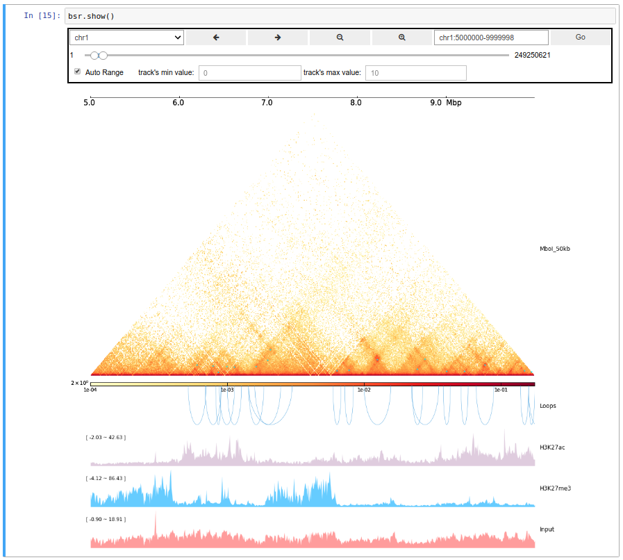

CoolBox
=======

Jupyter notebook based genomic data visualization toolkit.
---------------------------------------------------------

Use [pyGenomeTracks](https://github.com/deeptools/pyGenomeTracks) as plot system.

* Multi-omics data visualization
* GUI widget
* User-friendly API
* Web Access
* Compatible with Jupyter ecosystem

Documents:
* [Wiki](https://github.com/Nanguage/CoolBox/wiki)
* Jupyter notebook [walkthrough](demo/coolbox_guide.ipynb)
