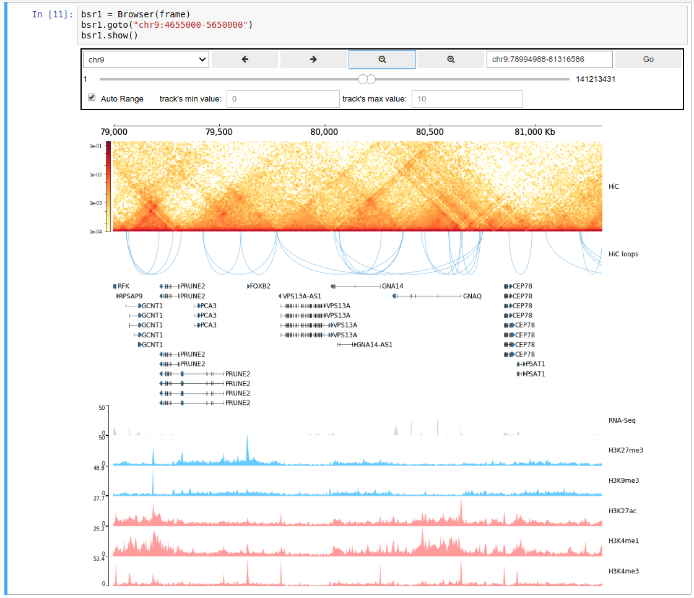

CoolBox
=======

WIP

Flexible, user-friendly genomic data visualization toolkit. 

Highlights:

* Multi-omics data interactively visualization
* Show within Jupyter notebook
* User-friendly API (ggplot2-like Python EDSL)

Documents:
* [Wiki](https://github.com/Nanguage/CoolBox/wiki)
* Jupyter notebook [walkthrough](demo/coolbox_guide.ipynb)

TODO List:

+ Install with conda
    + Upload to [Bioconda](https://bioconda.github.io/)
+ Better documents.
+ Optimizing plot
    + other ploting system(JS based)
+ Support more data type
    + Image type

Thanks

+ [pyGenomeTracks](https://github.com/deeptools/pyGenomeTracks),
CoolBox's plot system is fork from it.

