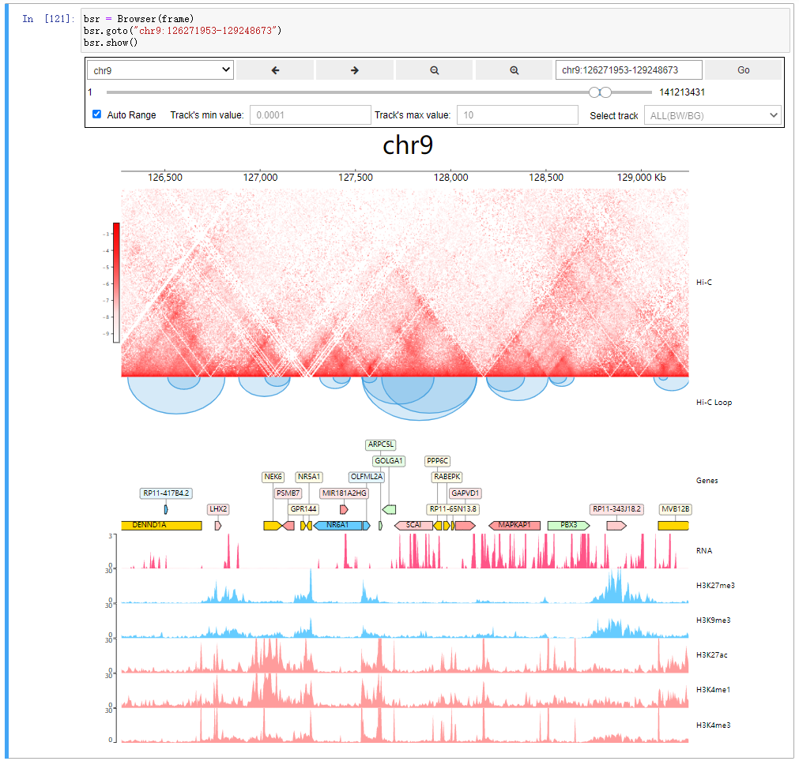

  

  
  
  
  
  
  
  
  
  
  
 
  
  

 
 

WIP

Flexible, user-friendly genomic data visualization toolkit. 

Highlights:

* Multi-omics data interactively visualization.
* User-friendly [API (ggplot2-like Python EDSL)](https://gangcaolab.github.io/CoolBox/quick_start_API.html) and [CLI](https://gangcaolab.github.io/CoolBox/quick_start_CLI.html).
* Show within Jupyter notebook.
* Ease to fetch data and in cooperation with other Python package.
* Ease to implement/add custom track and integrate into CoolBox.

More details please read the [documentation](https://gangcaolab.github.io/CoolBox/index.html).
Interactively online demo: [binder](https://mybinder.org/v2/gh/GangCaoLab/CoolBox/master?filepath=tests%2FTestRegion.ipynb)

Thanks

+ [pyGenomeTracks](https://github.com/deeptools/pyGenomeTracks),
CoolBox's plot system is fork from it.

