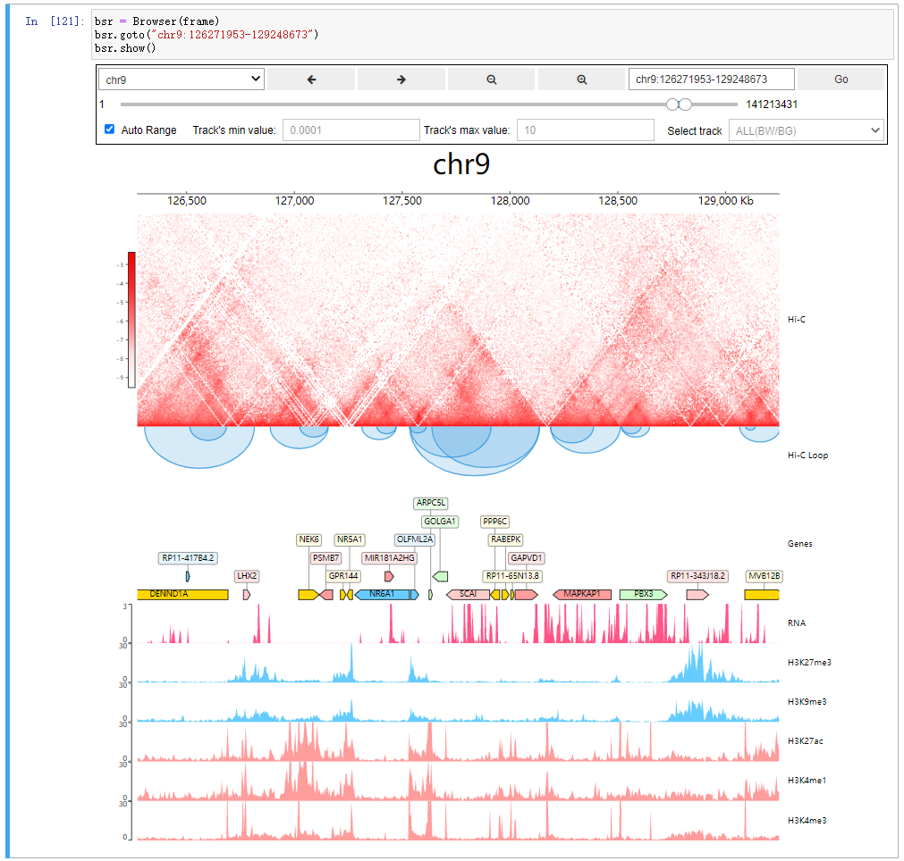

.. CoolBox documentation master file, created by
   sphinx-quickstart on Fri Oct 30 21:53:09 2020.
   You can adapt this file completely to your liking, but it should at least
   contain the root `toctree` directive.

Welcome to CoolBox's documentation!
===================================

Project page: `GitHub <https://github.com/GangCaoLab/CoolBox>`_

.. toctree::
   :maxdepth: 2

   installation
   quick_start_API.ipynb
   quick_start_CLI.ipynb
   gallery.rst
   custom_elements.ipynb
   api.rst

