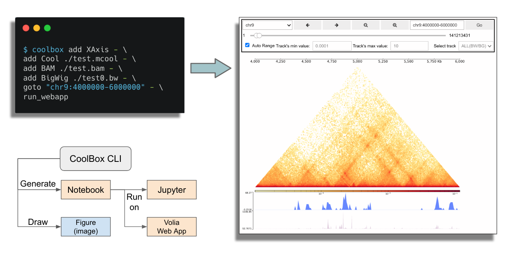

# Installation & Usage

## Install CoolBox

Recommend use [conda](https://docs.conda.io/en/latest/miniconda.html) to manage environments.

You can install from the bioconda channel:

```bash
$ conda install -c bioconda coolbox
```

Or install from the source code,
by this way you can use the latest updated features:

```bash
$ git clone https://github.com/GangCaoLab/CoolBox.git
$ cd CoolBox
$ conda env create --file environment.yml
$ conda activate coolbox
$ python -m pip install . --no-deps -vv
```

Enable `ipywidgets` to use the browser in Jupyter notebook:

```bash
$ jupyter nbextension enable --py widgetsnbextension
``` 

## Usage

There are two kinds of way to use CoolBox. 
Directly using it's Python API or using the command line interface.

### API

User can import `coolbox` in Jupyter notebook to 
draw figures or compose a Browser object to
interactively explore their genomic data. 


For this purpose, you can reference this
[Quickstart (API) page](https://gangcaolab.github.io/CoolBox/quick_start_API.html).


Or just import `coolbox` as a
Python plot package use in their own plot
script(see [example](https://todo)).


### CLI

Their are another more convenient way
to use CoolBox for command line user.
They can directly draw genomic track plot or
compose browser by simple command line:



### For Windows Users

CoolBox not support run on Windows natively for now.
But you can use the WSL(Windows Subsystem for Linux) to run it.
See [this](https://docs.microsoft.com/en-us/windows/wsl/install-win10)

Or, you can choice to use docker on Windows.

### Docker

Pull the CoolBox docker image:

```
$ docker pull nanguage/coolbox
```

Run a container, with mount current directory in file system to the '/data' in the container.
And binding the container port 8888(jupyter default port) to the host port 9000:

```
$ docker run -ti -p 9000:8888 nanguage/coolbox:latest
```

Then run jupyter notebook in the container:

```
$ jupyter notebook --ip=0.0.0.0 --allow-root
```
