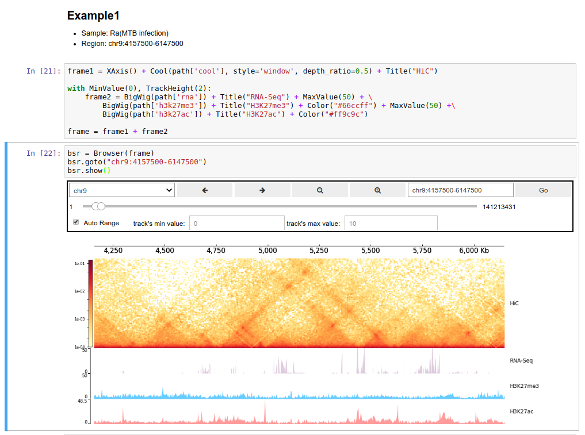

# Installation & Usage

## Install CoolBox

Recommend use [conda](https://docs.conda.io/en/latest/miniconda.html) to manage environments.

You can install from the bioconda channel:

```bash
$ conda install -c bioconda coolbox
```

Or install from the source code,
by this way you can use the latest updated features:

```bash
$ git clone https://github.com/GangCaoLab/CoolBox.git
$ cd CoolBox
$ conda env create --file environment.yml
$ conda activate coolbox
$ python setup.py install
```

Another way is install from PyPI. But you should ensure these
[dependency](https://github.com/GangCaoLab/CoolBox/blob/master/environment.yml)
is installed.

```bash
$ pip install coolbox
```


After installation, you should
enable `ipywidgets` to use the browser in Jupyter notebook:

```bash
$ jupyter nbextension enable --py widgetsnbextension
``` 

## Usage

CoolBox can be use in two ways. 
Directly using its Python API or using the command line interface.

### API

User can import `coolbox` in Jupyter notebook to 
draw figures or compose a Browser object to
interactively explore their genomic data. 



For this purpose, you can reference this
[Quickstart (API) page](https://gangcaolab.github.io/CoolBox/quick_start_API.html).
Or just import `coolbox` as a
Python plot package use in their own plot
script.


### CLI

Command line users can use CoolBox in a more convenient way. They can directly draw genomic track plot or
compose browser by simple command line:


### For Windows Users

Currently, CoolBox cannot be run natively on Windows.
But you can use the WSL(Windows Subsystem for Linux) to run it.
See [this](https://docs.microsoft.com/en-us/windows/wsl/install-win10)

Or, you can choose to use docker on Windows.

### Docker

Pull the CoolBox docker image:

```
$ docker pull nanguage/coolbox
```

Run a container, with mount current directory in file system to the '/data' in the container.
And binding the container port `8888` (jupyter default port) to the host port `9000`:

```
$ docker run -ti -v $(pwd):/data -p 9000:8888 nanguage/coolbox:latest
```

Then run jupyter notebook in the container:

```
$ jupyter notebook --ip=0.0.0.0 --allow-root
## will print the token here
```

Then open http://127.0.0.1:9000/ with your browser, and type the
token printed in the console.

